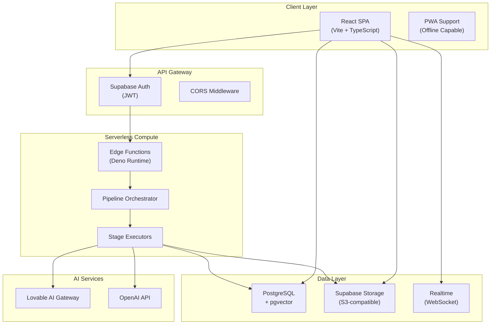
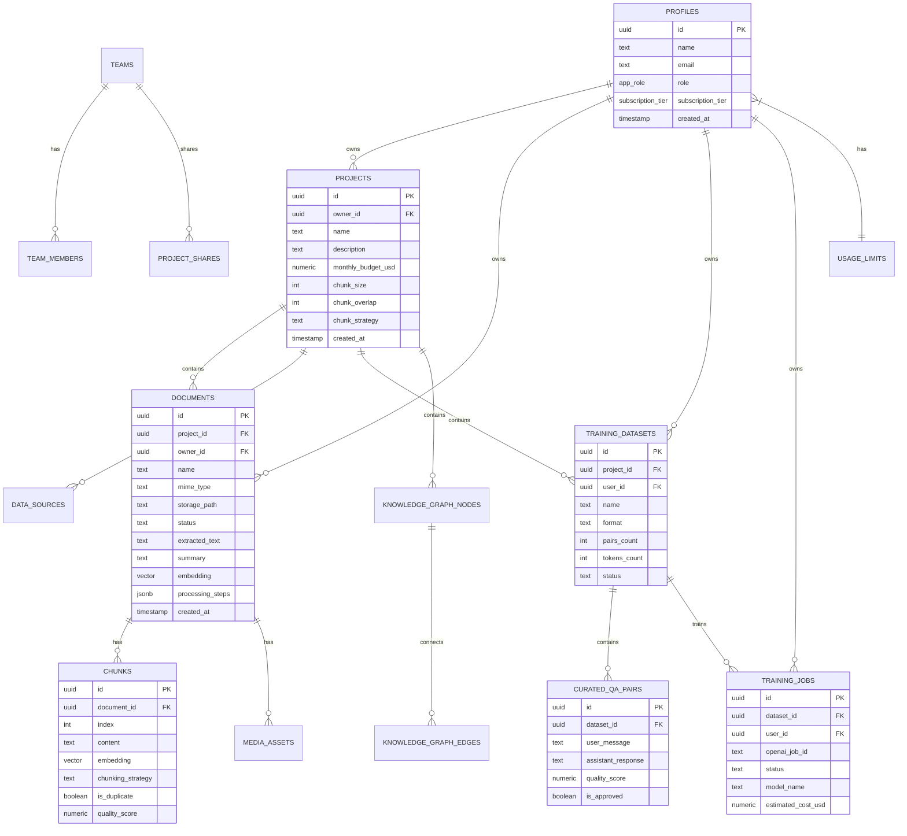
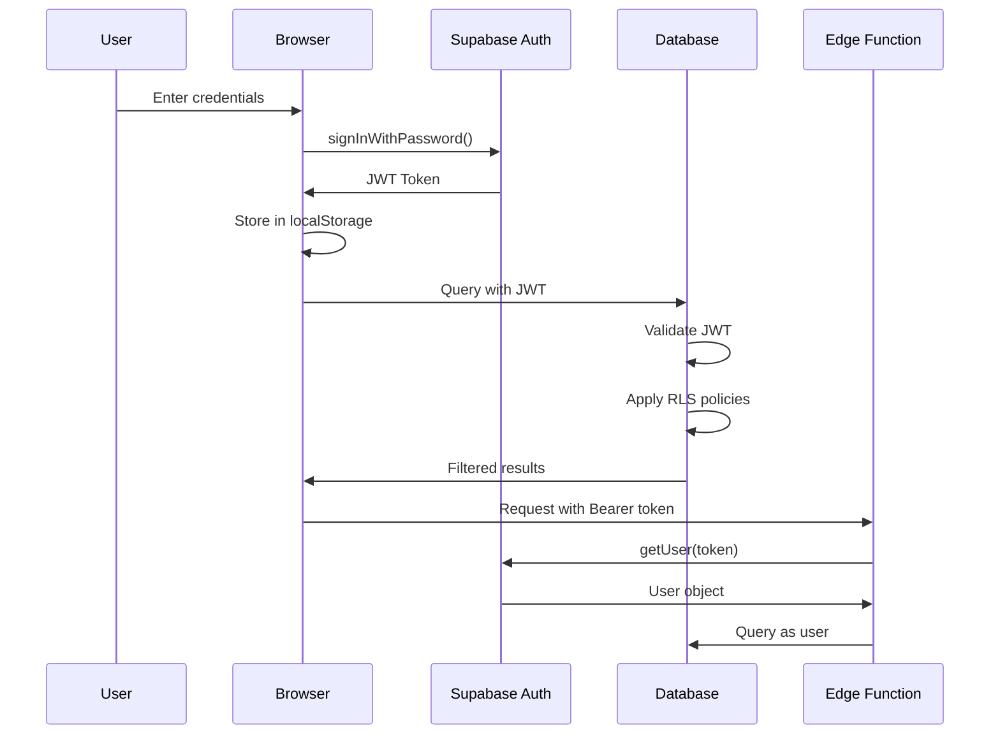
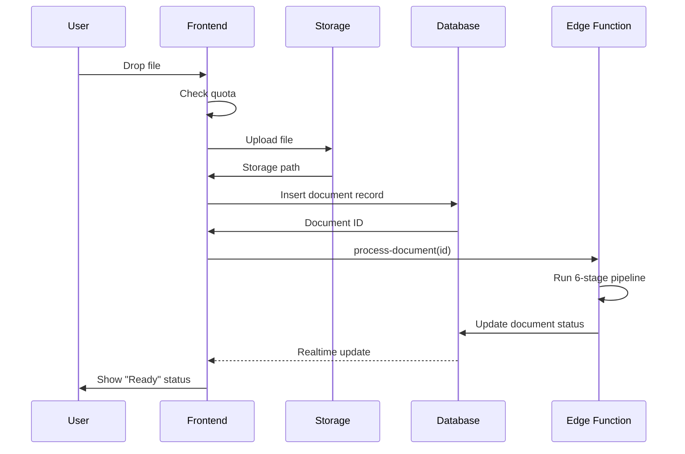
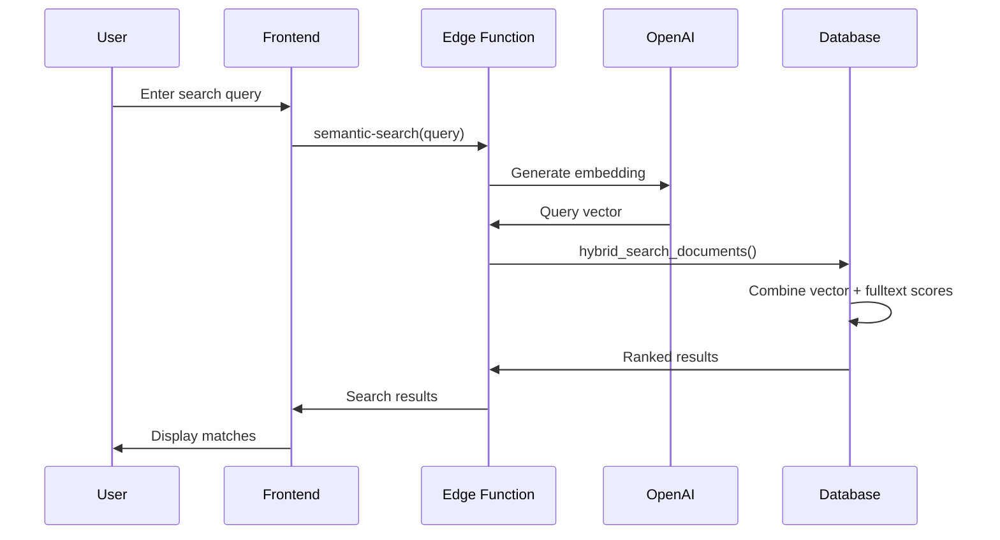

# FineFlow Architecture

## Table of Contents

1. [System Overview](#system-overview)
2. [High-Level Architecture](#high-level-architecture)
3. [Database Schema](#database-schema)
4. [Pipeline Architecture](#pipeline-architecture)
5. [Authentication & Authorization](#authentication--authorization)
6. [Data Flow](#data-flow)
7. [Module Structure](#module-structure)

---

## System Overview

FineFlow uses a **serverless architecture** built on Lovable Cloud (powered by Supabase). The frontend is a React SPA that communicates with the backend via:

1. **Supabase Client** - Direct database access with RLS protection
2. **Edge Functions** - Serverless compute for AI operations and complex logic
3. **Realtime** - WebSocket subscriptions for live updates

---

## High-Level Architecture



### Architecture Layers

| Layer | Technology | Purpose |
|-------|------------|---------|
| Presentation | React, Tailwind, shadcn/ui | User interface |
| State Management | React Query, Context | Client-side state |
| Service | TypeScript services | API abstraction |
| API Gateway | Supabase Auth, Edge Functions | Authentication, routing |
| Business Logic | Edge Functions (Deno) | Document processing, AI |
| Data Access | Supabase Client, RLS | Database operations |
| Storage | Supabase Storage | File storage |
| AI | Lovable AI, OpenAI | Embeddings, generation |

---

## Database Schema

### Entity Relationship Diagram



### Core Tables

| Table | Purpose | Row Count Estimate |
|-------|---------|-------------------|
| `profiles` | User accounts and settings | ~1K |
| `projects` | Project containers | ~10K |
| `documents` | Uploaded documents | ~100K |
| `chunks` | Document segments | ~1M |
| `training_datasets` | Training data collections | ~10K |
| `curated_qa_pairs` | Q&A training pairs | ~500K |
| `training_jobs` | Fine-tuning job records | ~5K |
| `knowledge_graph_nodes` | Extracted entities | ~100K |
| `knowledge_graph_edges` | Entity relationships | ~500K |
| `audit_logs` | Activity logging | ~1M |

### Key JSONB Structures

#### `documents.processing_steps`

```json
[
  {
    "stage": "ingestion",
    "status": "completed",
    "started_at": "2024-01-15T10:00:00Z",
    "completed_at": "2024-01-15T10:00:01Z",
    "duration_ms": 150,
    "executor_version": "ingestion-executor-v1",
    "version_info": {
      "pipeline_version": "v5.0-artifacts",
      "executor_version": "ingestion-executor-v1"
    }
  }
]
```

#### `documents.processing_metadata`

```json
{
  "pipeline_version": "v5.0-artifacts",
  "extracted_text_hash": "sha256...",
  "chunking_config_hash": "sha256...",
  "embedding_model": "text-embedding-3-small",
  "embedding_model_version": "2024-01",
  "artifacts": {
    "extracted_text_ref": "documents.extracted_text",
    "chunks_ref": "chunks table (document_id=..., count=25)",
    "embeddings_ref": "documents.embedding + chunks.embedding"
  }
}
```

---

## Pipeline Architecture

### 6-Stage Document Processing Pipeline


### Orchestrator Pattern

The `process-document` function acts as a **control plane** orchestrator:

```typescript
// Orchestrator Configuration
const CONFIG = {
  maxRetries: 2,
  stageTimeouts: {
    ingestion: 30000,      // 30s
    text_extraction: 60000, // 60s
    language_detection: 25000,
    chunking: 45000,
    summarization: 30000,
    indexing: 60000,
  },
  criticalStages: ['ingestion', 'text_extraction', 'chunking'],
  continueOnOptionalFailure: true,
};
```

### Design Principles

1. **Reference-Based Data Passing**: Executors receive IDs/paths, not raw data
2. **Versioned Artifacts**: All outputs tracked with version metadata
3. **Failure Isolation**: Optional stages don't block pipeline completion
4. **Resume Capability**: Resume from any failed stage

---

## Authentication & Authorization

### Auth Flow



### Role-Based Access Control

| Role | Permissions |
|------|-------------|
| `user` | CRUD own resources only |
| `admin` | View all users, system metrics |
| `super_admin` | Modify user roles, full access |

### RLS Policy Patterns

```sql
-- Owner-based access
CREATE POLICY "Users can view their own projects"
ON projects FOR SELECT
USING (owner_id = auth.uid());

-- Access via join
CREATE POLICY "Users can view chunks of their own documents"
ON chunks FOR SELECT
USING (EXISTS (
  SELECT 1 FROM documents
  WHERE documents.id = chunks.document_id
  AND documents.owner_id = auth.uid()
));

-- Admin override
CREATE POLICY "Admins can view all profiles"
ON profiles FOR SELECT
USING (is_admin(auth.uid()));
```

---

## Data Flow

### Document Upload Flow



### Search Flow



---

## Module Structure

### Frontend Structure

```
src/
├── components/           # Reusable UI components
│   ├── ui/              # shadcn/ui primitives
│   ├── layout/          # Layout components
│   ├── documents/       # Document components
│   ├── training/        # Training components
│   ├── search/          # Search components
│   ├── graph/           # Knowledge graph components
│   ├── admin/           # Admin components
│   └── ...
├── pages/               # Route components
│   ├── Dashboard.tsx
│   ├── Projects.tsx
│   ├── ProjectDetail.tsx
│   ├── Training.tsx
│   ├── admin/           # Admin pages
│   └── ...
├── hooks/               # React hooks
│   ├── useDocuments.ts
│   ├── useTraining.ts
│   ├── useSearch.ts
│   └── ...
├── services/            # API abstraction
│   ├── documentService.ts
│   ├── trainingService.ts
│   ├── searchService.ts
│   └── ...
├── types/               # TypeScript types
└── lib/                 # Utilities
```

### Edge Functions Structure

```
supabase/functions/
├── _shared/                    # Shared utilities
│   ├── pipeline-types.ts       # Type definitions
│   ├── artifact-registry.ts    # Version tracking
│   ├── execution-contracts.ts  # Schema validation
│   ├── semantic-chunking.ts    # Chunking strategies
│   ├── metrics-collector.ts    # Metrics collection
│   ├── ai-safety.ts            # Prompt injection guards
│   └── stage-helpers.ts        # Common utilities
├── process-document/           # Pipeline orchestrator
├── ingestion-executor/         # Stage 1
├── extraction-executor/        # Stage 2
├── language-executor/          # Stage 3
├── chunking-executor/          # Stage 4
├── summarization-executor/     # Stage 5
├── indexing-executor/          # Stage 6
├── semantic-search/            # Hybrid search
├── generate-training-data/     # Dataset generation
├── start-training/             # OpenAI fine-tuning
└── ...                         # 50+ more functions
```

---

## Related Documentation

- [API_REFERENCE.md](./API_REFERENCE.md) - Complete API documentation
- [DATABASE_SCHEMA.md](./DATABASE_SCHEMA.md) - Full database schema
- [AI_SERVICES.md](./AI_SERVICES.md) - AI providers and prompts
- [SECURITY.md](./SECURITY.md) - Security implementation details
