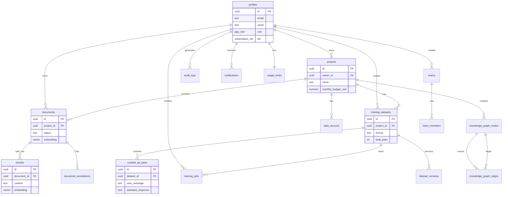

# FineFlow Database Schema

## Table of Contents

1. [Overview](#overview)
2. [Entity Relationship Diagram](#entity-relationship-diagram)
3. [Core Tables](#core-tables)
4. [Training Tables](#training-tables)
5. [Collaboration Tables](#collaboration-tables)
6. [Analytics Tables](#analytics-tables)
7. [Support Tables](#support-tables)
8. [JSONB Field Structures](#jsonb-field-structures)
9. [Enums](#enums)
10. [Database Functions](#database-functions)
11. [Triggers](#triggers)
12. [Indexes](#indexes)
13. [Views](#views)
14. [Storage Buckets](#storage-buckets)

---

## Overview

FineFlow uses PostgreSQL via Supabase with the following extensions:

| Extension | Purpose |
|-----------|---------|
| `pgvector` | Vector similarity search for embeddings |
| `pg_trgm` | Trigram matching for fuzzy search |
| `uuid-ossp` | UUID generation |
| `pgcrypto` | Cryptographic functions |

---

## Entity Relationship Diagram



---

## Core Tables

### profiles

User profiles linked to Supabase Auth. Created automatically via trigger on signup.

| Column | Type | Nullable | Default | Description |
|--------|------|----------|---------|-------------|
| id | uuid | NO | - | Primary key, FK to auth.users |
| email | text | NO | - | User email (unique) |
| name | text | NO | - | Display name |
| role | app_role | NO | 'user' | user, admin, super_admin |
| subscription_tier | subscription_tier | NO | 'free' | free, starter, pro, enterprise |
| status | user_status | NO | 'active' | active, suspended |
| avatar_url | text | YES | NULL | Profile image URL |
| preferred_language | text | YES | 'en' | UI language preference |
| created_at | timestamptz | NO | now() | Account creation |
| updated_at | timestamptz | NO | now() | Last modification |

**RLS Policies:**
- SELECT: Own profile OR admin
- UPDATE: Own profile OR admin (role change requires super_admin)
- INSERT: Via trigger only
- DELETE: Not allowed

---

### projects

User projects (document collections with settings).

| Column | Type | Nullable | Default | Description |
|--------|------|----------|---------|-------------|
| id | uuid | NO | gen_random_uuid() | Primary key |
| owner_id | uuid | NO | - | FK to profiles |
| name | text | NO | - | Project name (max 100 chars) |
| description | text | NO | '' | Project description (max 500 chars) |
| status | text | NO | 'draft' | draft, active, archived |
| document_count | int | NO | 0 | Cached document count |
| chunk_size | int | YES | 1000 | Characters per chunk (100-4000) |
| chunk_overlap | int | YES | 200 | Overlap between chunks |
| chunk_strategy | text | YES | 'fixed' | fixed, sentence, semantic |
| embedding_model | text | YES | 'text-embedding-3-small' | Embedding model |
| monthly_budget_usd | numeric(10,2) | YES | 50.00 | Monthly spending limit |
| max_cost_per_query_usd | numeric(10,4) | YES | 0.01 | Per-query cost limit |
| budget_enforcement_mode | text | YES | 'warn' | warn, abort, auto_downgrade |
| budget_spent_this_month | numeric(10,4) | YES | 0 | Current month spending |
| auto_train_enabled | bool | YES | false | Auto-training enabled |
| system_prompt | text | YES | NULL | Custom system prompt |
| primary_jurisdiction | jurisdiction_region | YES | NULL | Legal jurisdiction |
| primary_dialect | arabic_dialect | YES | NULL | Arabic dialect preference |
| created_at | timestamptz | NO | now() | Creation timestamp |
| updated_at | timestamptz | NO | now() | Last modification |

**RLS Policies:**
- SELECT: Owner OR team member
- INSERT: Authenticated user (becomes owner)
- UPDATE: Owner only
- DELETE: Owner only (soft delete recommended)

---

### documents

Uploaded files and their processed content.

| Column | Type | Nullable | Default | Description |
|--------|------|----------|---------|-------------|
| id | uuid | NO | gen_random_uuid() | Primary key |
| project_id | uuid | NO | - | FK to projects |
| owner_id | uuid | NO | - | FK to profiles |
| name | text | NO | - | Display name |
| original_name | text | NO | - | Original filename |
| mime_type | text | NO | - | File MIME type |
| size_bytes | bigint | NO | - | File size in bytes |
| storage_path | text | NO | - | Path in storage bucket |
| status | text | NO | 'uploaded' | uploaded, processing, ready, error |
| processing_stage | processing_stage | YES | NULL | Current pipeline stage |
| error_message | text | YES | NULL | Error details if failed |
| extracted_text | text | YES | NULL | Full extracted text |
| summary | text | YES | NULL | AI-generated summary |
| language | text | YES | NULL | Detected language (ISO 639-1) |
| word_count | int | YES | 0 | Word count |
| page_count | int | YES | NULL | Page count (for PDFs) |
| quality_score | numeric(3,2) | YES | NULL | Content quality 0.00-1.00 |
| embedding | vector(1536) | YES | NULL | Document-level embedding |
| search_vector | tsvector | YES | NULL | Full-text search vector |
| processing_steps | jsonb | YES | '[]' | Stage execution history |
| processing_metadata | jsonb | YES | '{}' | Artifact versioning |
| extraction_metadata | jsonb | YES | NULL | Extraction details |
| processed_at | timestamptz | YES | NULL | Processing completion |
| deleted_at | timestamptz | YES | NULL | Soft delete timestamp |
| created_at | timestamptz | NO | now() | Upload timestamp |
| updated_at | timestamptz | NO | now() | Last modification |

**RLS Policies:**
- SELECT: Owner AND deleted_at IS NULL
- INSERT: Authenticated user (quota checked)
- UPDATE: Owner only
- DELETE: Owner only (sets deleted_at)

---

### chunks

Document chunks for granular search and training data generation.

| Column | Type | Nullable | Default | Description |
|--------|------|----------|---------|-------------|
| id | uuid | NO | gen_random_uuid() | Primary key |
| document_id | uuid | NO | - | FK to documents |
| content | text | NO | - | Chunk text content |
| index | int | NO | - | Position in document (0-indexed) |
| hash | text | YES | NULL | SHA-256 content hash |
| is_duplicate | bool | YES | false | Duplicate detection flag |
| quality_score | numeric(3,2) | YES | NULL | Content quality 0.00-1.00 |
| embedding | vector(1536) | YES | NULL | Chunk embedding |
| embedding_model | text | YES | NULL | Model used (e.g., text-embedding-3-small) |
| embedding_model_version | text | YES | NULL | Model version |
| chunking_strategy | text | YES | NULL | Strategy: fixed, sentence, semantic |
| chunking_version | text | YES | NULL | Chunker version |
| vector_dimension | int | YES | 1536 | Embedding dimension |
| search_vector | tsvector | YES | NULL | Full-text search vector |
| metadata | jsonb | YES | '{}' | Additional metadata |
| created_at | timestamptz | NO | now() | Creation timestamp |

**RLS Policies:**
- SELECT: Via document ownership
- INSERT: Via document ownership
- UPDATE: Not allowed (immutable)
- DELETE: Via document ownership (cascades from document)

---

### data_sources

External data sources (URLs, APIs, manual text).

| Column | Type | Nullable | Default | Description |
|--------|------|----------|---------|-------------|
| id | uuid | NO | gen_random_uuid() | Primary key |
| project_id | uuid | NO | - | FK to projects |
| user_id | uuid | NO | - | FK to profiles |
| name | text | NO | - | Source name |
| source_type | text | NO | - | url, file, text, api |
| original_url | text | YES | NULL | Source URL |
| file_path | text | YES | NULL | Storage path |
| file_name | text | YES | NULL | Original filename |
| file_size | bigint | YES | NULL | File size |
| mime_type | text | YES | NULL | MIME type |
| raw_content | text | YES | NULL | Raw text content |
| status | text | YES | 'pending' | pending, processing, ready, error |
| error_message | text | YES | NULL | Error details |
| metadata | jsonb | YES | '{}' | Source metadata |
| created_at | timestamptz | YES | now() | Creation timestamp |
| updated_at | timestamptz | YES | now() | Last update |

---

## Training Tables

### training_datasets

Collections of Q&A pairs for fine-tuning.

| Column | Type | Nullable | Default | Description |
|--------|------|----------|---------|-------------|
| id | uuid | NO | gen_random_uuid() | Primary key |
| project_id | uuid | NO | - | FK to projects |
| user_id | uuid | NO | - | FK to profiles |
| name | text | NO | - | Dataset name |
| description | text | YES | NULL | Description |
| format | text | NO | 'openai' | openai, anthropic, alpaca, sharegpt |
| pair_generation_mode | text | YES | NULL | auto, qa, instruction, conversation |
| system_prompt | text | YES | NULL | System prompt for training |
| total_pairs | int | YES | 0 | Count of pairs |
| approved_pairs | int | YES | 0 | Approved pairs count |
| total_tokens | int | YES | 0 | Estimated token count |
| estimated_cost | numeric(10,4) | YES | NULL | Estimated training cost |
| status | text | YES | 'draft' | draft, generating, ready, training, completed, failed |
| error_message | text | YES | NULL | Error if failed |
| jsonl_content | text | YES | NULL | Generated JSONL |
| validation_result | jsonb | YES | NULL | Validation details |
| current_version | int | YES | 1 | Current version number |
| generated_at | timestamptz | YES | NULL | Generation timestamp |
| created_at | timestamptz | YES | now() | Creation timestamp |
| updated_at | timestamptz | YES | now() | Last update |

---

### curated_qa_pairs

Individual Q&A pairs in a dataset.

| Column | Type | Nullable | Default | Description |
|--------|------|----------|---------|-------------|
| id | uuid | NO | gen_random_uuid() | Primary key |
| dataset_id | uuid | NO | - | FK to training_datasets |
| project_id | uuid | NO | - | FK to projects |
| user_id | uuid | NO | - | FK to profiles |
| system_prompt | text | YES | NULL | System message |
| user_message | text | NO | - | User question/input |
| assistant_response | text | NO | - | Assistant response |
| source_id | uuid | YES | NULL | Source chunk or document ID |
| source_type | text | NO | 'chunk' | chunk, document, manual |
| quality_score | numeric(3,2) | YES | NULL | Quality 0.00-1.00 |
| quality_flags | text[] | YES | NULL | Quality issues |
| token_count | int | YES | NULL | Estimated tokens |
| is_approved | bool | YES | false | Curation status |
| approved_by | uuid | YES | NULL | Approver user ID |
| approved_at | timestamptz | YES | NULL | Approval timestamp |
| metadata | jsonb | YES | '{}' | Additional data |
| created_at | timestamptz | YES | now() | Creation timestamp |
| updated_at | timestamptz | YES | now() | Last update |

---

### training_jobs

Fine-tuning job tracking.

| Column | Type | Nullable | Default | Description |
|--------|------|----------|---------|-------------|
| id | uuid | NO | gen_random_uuid() | Primary key |
| dataset_id | uuid | NO | - | FK to training_datasets |
| project_id | uuid | NO | - | FK to projects |
| user_id | uuid | NO | - | FK to profiles |
| provider | text | NO | 'openai' | Training provider |
| base_model | text | NO | - | Base model ID |
| status | text | NO | 'pending' | pending, uploading, validating, queued, training, completed, failed, cancelled |
| progress_percent | int | YES | 0 | Progress 0-100 |
| current_step | text | YES | NULL | Current step description |
| provider_job_id | text | YES | NULL | External job ID |
| provider_file_id | text | YES | NULL | Uploaded file ID |
| fine_tuned_model_id | text | YES | NULL | Result model ID |
| training_config | jsonb | YES | '{}' | Hyperparameters |
| result_metrics | jsonb | YES | NULL | Training metrics |
| total_cost_usd | numeric(10,4) | YES | NULL | Actual cost |
| tokens_trained | bigint | YES | NULL | Tokens processed |
| error_message | text | YES | NULL | Error if failed |
| auto_started | bool | YES | false | Auto-training flag |
| started_at | timestamptz | YES | NULL | Job start time |
| completed_at | timestamptz | YES | NULL | Job end time |
| created_at | timestamptz | NO | now() | Creation timestamp |
| updated_at | timestamptz | NO | now() | Last update |

---

### dataset_versions

Version control for training datasets.

| Column | Type | Nullable | Default | Description |
|--------|------|----------|---------|-------------|
| id | uuid | NO | gen_random_uuid() | Primary key |
| dataset_id | uuid | NO | - | FK to training_datasets |
| version_number | int | NO | - | Version number |
| name | text | YES | NULL | Version name |
| description | text | YES | NULL | Version description |
| changes_summary | text | YES | NULL | Change summary |
| pairs_count | int | YES | NULL | Pairs at this version |
| tokens_count | int | YES | NULL | Tokens at this version |
| snapshot | jsonb | NO | '{}' | Full snapshot data |
| created_by | uuid | NO | - | Creator user ID |
| created_at | timestamptz | NO | now() | Creation timestamp |

---

## Collaboration Tables

### teams

Team definitions.

| Column | Type | Nullable | Default | Description |
|--------|------|----------|---------|-------------|
| id | uuid | NO | gen_random_uuid() | Primary key |
| name | text | NO | - | Team name |
| description | text | YES | NULL | Description |
| owner_id | uuid | NO | - | FK to profiles |
| created_at | timestamptz | NO | now() | Creation timestamp |
| updated_at | timestamptz | NO | now() | Last update |

---

### team_members

Team membership.

| Column | Type | Nullable | Default | Description |
|--------|------|----------|---------|-------------|
| id | uuid | NO | gen_random_uuid() | Primary key |
| team_id | uuid | NO | - | FK to teams |
| user_id | uuid | NO | - | FK to profiles |
| role | team_role | NO | 'viewer' | owner, admin, editor, viewer |
| invited_by | uuid | YES | NULL | Inviter user ID |
| joined_at | timestamptz | NO | now() | Join timestamp |

**Unique constraint:** (team_id, user_id)

---

### document_annotations

Document comments and annotations.

| Column | Type | Nullable | Default | Description |
|--------|------|----------|---------|-------------|
| id | uuid | NO | gen_random_uuid() | Primary key |
| document_id | uuid | NO | - | FK to documents |
| user_id | uuid | NO | - | FK to profiles |
| team_id | uuid | YES | NULL | FK to teams |
| annotation_type | annotation_type | NO | 'comment' | comment, highlight, question |
| content | text | NO | - | Annotation text |
| selected_text | text | YES | NULL | Highlighted text |
| position | jsonb | YES | NULL | Position data |
| page_number | int | YES | NULL | Page number |
| start_offset | int | YES | NULL | Start character offset |
| end_offset | int | YES | NULL | End character offset |
| mentions | text[] | YES | NULL | Mentioned user IDs |
| replies | jsonb | YES | NULL | Reply thread |
| ai_response | text | YES | NULL | AI response to question |
| ai_responded_at | timestamptz | YES | NULL | AI response time |
| is_resolved | bool | YES | false | Resolution status |
| resolved_by | uuid | YES | NULL | Resolver user ID |
| resolved_at | timestamptz | YES | NULL | Resolution time |
| created_at | timestamptz | NO | now() | Creation timestamp |
| updated_at | timestamptz | NO | now() | Last update |

---

### shared_chat_threads

Collaborative chat threads.

| Column | Type | Nullable | Default | Description |
|--------|------|----------|---------|-------------|
| id | uuid | NO | gen_random_uuid() | Primary key |
| project_id | uuid | NO | - | FK to projects |
| team_id | uuid | YES | NULL | FK to teams |
| title | text | NO | - | Thread title |
| description | text | YES | NULL | Thread description |
| created_by | uuid | NO | - | Creator user ID |
| parent_thread_id | uuid | YES | NULL | Parent for branching |
| branch_point_message_id | uuid | YES | NULL | Branch point |
| is_archived | bool | YES | false | Archive status |
| pinned_messages | uuid[] | YES | NULL | Pinned message IDs |
| created_at | timestamptz | NO | now() | Creation timestamp |
| updated_at | timestamptz | NO | now() | Last update |

---

## Analytics Tables

### knowledge_graph_nodes

Entity nodes for knowledge graph.

| Column | Type | Nullable | Default | Description |
|--------|------|----------|---------|-------------|
| id | uuid | NO | gen_random_uuid() | Primary key |
| project_id | uuid | NO | - | FK to projects |
| document_id | uuid | YES | NULL | Source document |
| entity_type | entity_type | NO | - | person, organization, location, etc. |
| name | text | NO | - | Entity name |
| normalized_name | text | YES | NULL | Normalized for matching |
| description | text | YES | NULL | Entity description |
| properties | jsonb | YES | '{}' | Additional properties |
| embedding | vector(1536) | YES | NULL | Entity embedding |
| mention_count | int | YES | 1 | Occurrence count |
| confidence_score | numeric(3,2) | YES | NULL | Extraction confidence |
| created_at | timestamptz | NO | now() | Creation timestamp |
| updated_at | timestamptz | NO | now() | Last update |

---

### knowledge_graph_edges

Relationships between entities.

| Column | Type | Nullable | Default | Description |
|--------|------|----------|---------|-------------|
| id | uuid | NO | gen_random_uuid() | Primary key |
| project_id | uuid | NO | - | FK to projects |
| source_node_id | uuid | NO | - | FK to knowledge_graph_nodes |
| target_node_id | uuid | NO | - | FK to knowledge_graph_nodes |
| relationship_type | relationship_type | NO | - | works_for, located_in, etc. |
| description | text | YES | NULL | Relationship description |
| properties | jsonb | YES | '{}' | Additional properties |
| weight | numeric(5,4) | YES | 1.0 | Relationship strength |
| confidence_score | numeric(3,2) | YES | NULL | Extraction confidence |
| source_chunk_id | uuid | YES | NULL | Evidence source |
| created_at | timestamptz | NO | now() | Creation timestamp |

---

### document_scores

Risk and opportunity scoring for documents.

| Column | Type | Nullable | Default | Description |
|--------|------|----------|---------|-------------|
| id | uuid | NO | gen_random_uuid() | Primary key |
| document_id | uuid | NO | - | FK to documents (unique) |
| project_id | uuid | NO | - | FK to projects |
| user_id | uuid | NO | - | FK to profiles |
| risk_score | numeric(3,2) | YES | NULL | Risk score 0.00-1.00 |
| opportunity_score | numeric(3,2) | YES | NULL | Opportunity score |
| risk_factors | jsonb | YES | NULL | Risk factor details |
| opportunity_factors | jsonb | YES | NULL | Opportunity factors |
| flagged_clauses | jsonb | YES | NULL | Flagged clauses |
| key_dates | jsonb | YES | NULL | Important dates |
| compliance_issues | jsonb | YES | NULL | Compliance concerns |
| ai_summary | text | YES | NULL | AI analysis summary |
| expires_at | timestamptz | YES | NULL | Document expiry |
| scored_at | timestamptz | NO | now() | Scoring timestamp |
| created_at | timestamptz | NO | now() | Creation timestamp |
| updated_at | timestamptz | NO | now() | Last update |

---

## Support Tables

### audit_logs

User action audit trail.

| Column | Type | Nullable | Default | Description |
|--------|------|----------|---------|-------------|
| id | uuid | NO | gen_random_uuid() | Primary key |
| user_id | uuid | NO | - | Actor user ID |
| user_name | text | NO | - | Actor name at action time |
| action | text | NO | - | login, create, update, delete, etc. |
| resource_type | text | NO | - | document, project, etc. |
| resource_id | text | NO | - | Resource identifier |
| resource_name | text | NO | - | Resource name at action time |
| severity_level | text | YES | 'info' | info, warn, error |
| details | jsonb | YES | NULL | Additional context |
| request_id | uuid | YES | NULL | Request correlation ID |
| ip_address | text | YES | NULL | Client IP |
| user_agent | text | YES | NULL | Client user agent |
| created_at | timestamptz | NO | now() | Action timestamp |

---

### notifications

In-app notifications.

| Column | Type | Nullable | Default | Description |
|--------|------|----------|---------|-------------|
| id | uuid | NO | gen_random_uuid() | Primary key |
| user_id | uuid | NO | - | Target user |
| type | text | NO | - | Notification type |
| title | text | NO | - | Title |
| message | text | NO | - | Body text |
| data | jsonb | YES | NULL | Payload data |
| read | bool | NO | false | Read status |
| created_at | timestamptz | NO | now() | Creation timestamp |

---

### usage_limits

Per-user quota tracking.

| Column | Type | Nullable | Default | Description |
|--------|------|----------|---------|-------------|
| id | uuid | NO | gen_random_uuid() | Primary key |
| user_id | uuid | NO | - | FK to profiles (unique) |
| documents_count | int | NO | 0 | Current document count |
| processing_count | int | NO | 0 | Monthly processing count |
| storage_bytes | bigint | NO | 0 | Current storage usage |
| ai_requests_count | int | NO | 0 | Monthly AI requests |
| reset_date | timestamptz | NO | - | Next monthly reset |
| created_at | timestamptz | NO | now() | Creation timestamp |
| updated_at | timestamptz | NO | now() | Last update |

---

### tier_limits

Quota limits per subscription tier.

| Column | Type | Nullable | Default | Description |
|--------|------|----------|---------|-------------|
| tier | subscription_tier | NO | - | Primary key (enum) |
| documents_limit | int | YES | NULL | NULL = unlimited |
| processing_limit | int | YES | NULL | Monthly limit |
| storage_bytes_limit | bigint | YES | NULL | Storage limit |
| ai_requests_limit | int | YES | NULL | AI request limit |
| projects_limit | int | YES | NULL | Projects limit |

**Default Values:**

| Tier | Documents | Processing | Storage | AI Requests | Projects |
|------|-----------|------------|---------|-------------|----------|
| free | 10 | 50 | 100 MB | 100 | 3 |
| starter | 100 | 500 | 1 GB | 1000 | 10 |
| pro | 1000 | 5000 | 10 GB | 10000 | 50 |
| enterprise | NULL | NULL | NULL | NULL | NULL |

---

## JSONB Field Structures

### processing_steps (documents)

```json
[
  {
    "stage": "ingestion",
    "status": "completed",
    "started_at": "2024-01-15T10:00:00Z",
    "completed_at": "2024-01-15T10:00:05Z",
    "duration_ms": 5000,
    "executor_version": "1.2.0",
    "output": { "storage_path": "..." }
  },
  {
    "stage": "extraction",
    "status": "completed",
    "started_at": "2024-01-15T10:00:05Z",
    "completed_at": "2024-01-15T10:00:15Z",
    "duration_ms": 10000,
    "executor_version": "2.1.0",
    "output": { "word_count": 5000, "page_count": 10 }
  }
]
```

### training_config (training_jobs)

```json
{
  "n_epochs": 3,
  "batch_size": 4,
  "learning_rate_multiplier": 0.1,
  "suffix": "fineflow-custom",
  "validation_file": null
}
```

### validation_result (training_datasets)

```json
{
  "valid": true,
  "errors": [],
  "warnings": ["Some pairs have low quality scores"],
  "stats": {
    "total_pairs": 500,
    "valid_pairs": 495,
    "invalid_pairs": 5,
    "avg_tokens": 150,
    "total_tokens": 75000
  }
}
```

### position (document_annotations)

```json
{
  "page": 1,
  "x": 100,
  "y": 200,
  "width": 300,
  "height": 50,
  "rects": [
    { "x": 100, "y": 200, "width": 150, "height": 20 },
    { "x": 100, "y": 220, "width": 150, "height": 20 }
  ]
}
```

---

## Enums

```sql
-- User roles
CREATE TYPE app_role AS ENUM ('user', 'admin', 'super_admin');

-- Subscription tiers
CREATE TYPE subscription_tier AS ENUM ('free', 'starter', 'pro', 'enterprise');

-- Subscription status
CREATE TYPE subscription_status AS ENUM ('active', 'cancelled', 'expired', 'past_due');

-- User status
CREATE TYPE user_status AS ENUM ('active', 'suspended');

-- Team roles
CREATE TYPE team_role AS ENUM ('owner', 'admin', 'editor', 'viewer');

-- Processing stages
CREATE TYPE processing_stage AS ENUM (
  'ingestion', 'extraction', 'language_detection', 
  'chunking', 'summarization', 'indexing'
);

-- Knowledge graph entity types
CREATE TYPE entity_type AS ENUM (
  'person', 'organization', 'location', 'date', 
  'event', 'concept', 'document', 'custom'
);

-- Knowledge graph relationship types
CREATE TYPE relationship_type AS ENUM (
  'works_for', 'located_in', 'related_to', 'part_of',
  'references', 'authored_by', 'occurred_on', 'custom'
);

-- Arabic dialects
CREATE TYPE arabic_dialect AS ENUM (
  'msa', 'egyptian', 'gulf', 'levantine', 
  'maghrebi', 'iraqi', 'sudanese'
);

-- Legal jurisdictions
CREATE TYPE jurisdiction_region AS ENUM (
  'gcc', 'uae', 'ksa', 'egypt', 'levant', 
  'maghreb', 'international'
);

-- Annotation types
CREATE TYPE annotation_type AS ENUM ('comment', 'highlight', 'question');

-- Content formats
CREATE TYPE content_target_format AS ENUM (
  'blog_post', 'social_post', 'executive_summary',
  'technical_doc', 'email', 'presentation', 'custom'
);

-- Benchmark status
CREATE TYPE benchmark_status AS ENUM (
  'pending', 'running', 'completed', 'failed'
);

-- Evaluation status
CREATE TYPE evaluation_status AS ENUM (
  'pending', 'verifying', 'completed', 'failed'
);

-- Report status
CREATE TYPE report_status AS ENUM (
  'draft', 'generating', 'ready', 'failed'
);
```

---

## Database Functions

### Authentication & Authorization

```sql
-- Check if user has specific role
has_role(_user_id UUID, _role app_role) RETURNS BOOLEAN

-- Check if user is admin or super_admin
is_admin(_user_id UUID) RETURNS BOOLEAN

-- Check if user is super_admin only
is_super_admin(_user_id UUID) RETURNS BOOLEAN

-- Check team membership
is_team_member(_user_id UUID, _team_id UUID) RETURNS BOOLEAN

-- Check team role
has_team_role(_user_id UUID, _team_id UUID, _role team_role) RETURNS BOOLEAN
```

### Quota Management

```sql
-- Check if quota allows operation
check_quota(_user_id UUID, _quota_type TEXT) RETURNS BOOLEAN

-- Check storage quota
check_storage_quota(_user_id UUID, _incoming_bytes BIGINT) RETURNS BOOLEAN

-- Increment usage counter
increment_usage(_user_id UUID, _quota_type TEXT, _amount INT) RETURNS VOID

-- Decrement usage counter
decrement_usage(_user_id UUID, _quota_type TEXT, _amount INT) RETURNS VOID

-- Get complete quota status
get_quota_status(_user_id UUID) RETURNS JSONB
```

### Budget Management

```sql
-- Get current month spending for project
get_project_month_spending(p_project_id UUID) RETURNS NUMERIC

-- Check if operation fits within budget
check_project_budget(p_project_id UUID, p_estimated_cost NUMERIC) RETURNS JSONB
```

### Search Functions

```sql
-- Hybrid search (FTS + semantic) on documents
hybrid_search_documents(
  p_project_id UUID,
  p_query TEXT,
  p_query_embedding VECTOR(1536),
  p_match_count INT DEFAULT 10,
  p_full_text_weight FLOAT DEFAULT 0.5,
  p_semantic_weight FLOAT DEFAULT 0.5
) RETURNS TABLE(...)

-- Hybrid search on chunks
hybrid_search_chunks(
  p_project_id UUID,
  p_query TEXT,
  p_query_embedding VECTOR(1536),
  p_match_count INT DEFAULT 10
) RETURNS TABLE(...)

-- Pure semantic search on documents
search_documents_by_embedding(
  p_embedding VECTOR(1536),
  p_project_id UUID,
  p_match_count INT DEFAULT 10,
  p_match_threshold FLOAT DEFAULT 0.5
) RETURNS TABLE(...)

-- Pure semantic search on chunks
search_chunks_by_embedding(
  p_embedding VECTOR(1536),
  p_project_id UUID,
  p_match_count INT DEFAULT 20,
  p_match_threshold FLOAT DEFAULT 0.5
) RETURNS TABLE(...)
```

### Knowledge Graph

```sql
-- Find path between two nodes
find_graph_path(
  p_project_id UUID,
  p_source_node_id UUID,
  p_target_node_id UUID,
  p_max_depth INT DEFAULT 5
) RETURNS TABLE(...)

-- Get neighboring nodes
get_graph_neighbors(
  p_node_id UUID,
  p_depth INT DEFAULT 1,
  p_relationship_types relationship_type[] DEFAULT NULL
) RETURNS TABLE(...)
```

---

## Triggers

### Profile Creation

```sql
-- Automatically create profile when user signs up
CREATE TRIGGER on_auth_user_created
  AFTER INSERT ON auth.users
  FOR EACH ROW
  EXECUTE FUNCTION handle_new_user();

CREATE FUNCTION handle_new_user()
RETURNS TRIGGER AS $$
BEGIN
  INSERT INTO public.profiles (id, email, name)
  VALUES (
    NEW.id,
    NEW.email,
    COALESCE(NEW.raw_user_meta_data->>'name', split_part(NEW.email, '@', 1))
  );
  
  INSERT INTO public.usage_limits (user_id, reset_date)
  VALUES (NEW.id, date_trunc('month', now()) + interval '1 month');
  
  RETURN NEW;
END;
$$ LANGUAGE plpgsql SECURITY DEFINER;
```

### Updated Timestamps

```sql
-- Auto-update updated_at timestamp
CREATE FUNCTION update_updated_at_column()
RETURNS TRIGGER AS $$
BEGIN
  NEW.updated_at = now();
  RETURN NEW;
END;
$$ LANGUAGE plpgsql;

-- Applied to: profiles, projects, documents, training_datasets, training_jobs, etc.
```

### Document Count

```sql
-- Update project document count on insert/delete
CREATE TRIGGER update_project_document_count
  AFTER INSERT OR DELETE ON documents
  FOR EACH ROW
  EXECUTE FUNCTION update_project_document_count();
```

### Search Vector

```sql
-- Auto-generate search vector from content
CREATE TRIGGER documents_search_vector_update
  BEFORE INSERT OR UPDATE OF extracted_text ON documents
  FOR EACH ROW
  EXECUTE FUNCTION update_document_search_vector();
```

---

## Indexes

### Primary Indexes

| Table | Index | Type | Columns |
|-------|-------|------|---------|
| profiles | profiles_pkey | btree | id |
| profiles | profiles_email_key | btree | email (unique) |
| projects | projects_pkey | btree | id |
| documents | documents_pkey | btree | id |
| chunks | chunks_pkey | btree | id |
| training_datasets | training_datasets_pkey | btree | id |

### Foreign Key Indexes

| Table | Index | Columns |
|-------|-------|---------|
| projects | idx_projects_owner | owner_id |
| documents | idx_documents_project | project_id |
| documents | idx_documents_owner | owner_id |
| chunks | idx_chunks_document | document_id |
| training_datasets | idx_datasets_project | project_id |
| curated_qa_pairs | idx_pairs_dataset | dataset_id |
| training_jobs | idx_jobs_dataset | dataset_id |

### Search Indexes

| Table | Index | Type | Columns |
|-------|-------|------|---------|
| documents | idx_documents_search | GIN | search_vector |
| documents | idx_documents_embedding | ivfflat | embedding vector_cosine_ops |
| chunks | idx_chunks_search | GIN | search_vector |
| chunks | idx_chunks_embedding | ivfflat | embedding vector_cosine_ops |

### Performance Indexes

| Table | Index | Columns |
|-------|-------|---------|
| documents | idx_documents_status | status |
| documents | idx_documents_deleted | deleted_at |
| audit_logs | idx_audit_user | user_id |
| audit_logs | idx_audit_created | created_at DESC |
| notifications | idx_notifications_user_unread | user_id, read |

---

## Views

### v_stage_failure_rates

Materialized view for admin pipeline metrics.

```sql
CREATE MATERIALIZED VIEW v_stage_failure_rates AS
SELECT 
  stage,
  COUNT(*) as total_runs,
  COUNT(*) FILTER (WHERE success) as successful_runs,
  COUNT(*) FILTER (WHERE NOT success) as failed_runs,
  ROUND(AVG(duration_ms)::numeric, 2) as avg_duration_ms,
  PERCENTILE_CONT(0.95) WITHIN GROUP (ORDER BY duration_ms) as p95_duration_ms,
  MAX(created_at) as last_run_at
FROM processing_stage_metrics
WHERE created_at > now() - interval '7 days'
GROUP BY stage;

-- Refresh daily
CREATE INDEX idx_stage_failure_stage ON v_stage_failure_rates(stage);
```

### v_expensive_documents

View for cost analysis (documents with high processing costs).

```sql
CREATE VIEW v_expensive_documents AS
SELECT 
  d.id as document_id,
  d.name,
  d.project_id,
  p.name as project_name,
  d.size_bytes,
  SUM(psm.duration_ms) as total_processing_ms,
  COUNT(psm.id) as stage_count
FROM documents d
JOIN projects p ON p.id = d.project_id
LEFT JOIN processing_stage_metrics psm ON psm.document_id = d.id
GROUP BY d.id, d.name, d.project_id, p.name, d.size_bytes
HAVING SUM(psm.duration_ms) > 30000;  -- More than 30 seconds
```

---

## Storage Buckets

| Bucket | Public | Max File Size | Allowed Types |
|--------|--------|---------------|---------------|
| project-documents | No | 50 MB | PDF, DOCX, TXT, MD, HTML, JSON, CSV |
| data-sources | No | 50 MB | Same as above |
| media-assets | No | 100 MB | Images, Audio, Video |
| exports | No | 100 MB | JSON, CSV, JSONL, ZIP |

### Storage RLS Policies

All buckets use owner-scoped access via path prefix matching `auth.uid()`.

---

## Related Documentation

- [ARCHITECTURE.md](./ARCHITECTURE.md) - System design
- [SECURITY.md](./SECURITY.md) - RLS policies
- [API_REFERENCE.md](./API_REFERENCE.md) - Database functions
